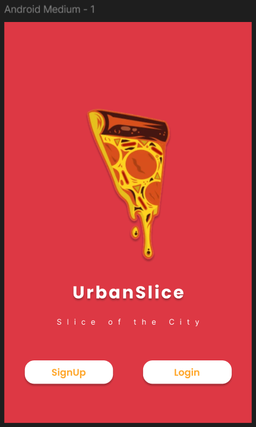

# UrbanSlice Food Delivery App 

A complete UI/UX design project for a modern food delivery application, showcasing the design process from low-fidelity wireframes to high-fidelity interactive prototypes.

## Project Overview

UrbanSlice is a food delivery app designed to provide seamless ordering experience for pizza and fast food lovers. This project demonstrates the complete design process including user research, wireframing, visual design, and prototyping.

## Features

- **User Authentication** - Secure login/signup flow
- **Menu Browsing** - Categorized food items with detailed views
- **Cart Management** - Easy item addition/removal with quantity controls
- **Order Tracking** - Real-time order status with delivery timeline
- **Multiple Payment Options** - Cash on delivery and card payments
- **User Profile** - Order history and account management

## Design Process

### Phase 1: Low-Fidelity Wireframes
- Initial concept validation
- User flow mapping
- Basic layout structure

### Phase 2: High-Fidelity Designs
- Visual design system implementation
- Interactive prototyping
- Usability testing preparation

## User Flow
Welcome → Login → Home → Category → Item Details → Cart → Checkout → Order Confirmation → Tracking → Profile

## Design System

### Color Palette
- **Primary**: #FF6B35 (Orange) - Brand color for actions and highlights
- **Secondary**: #2EC4B6 (Teal) - Secondary actions and information
- **Neutral**: #F8F9FA, #6C757D, #212529 - Text and backgrounds
- **Success**: #28A745 - Positive actions and status
- **Warning**: #FFC107 - Warnings and attention needed

### Typography
- **Headlines**: Poppins Bold
- **Body Text**: Inter Regular
- **Labels**: Inter Medium

### Components
- Buttons (Primary, Secondary, Ghost)
- Cards (Product, Order, Category)
- Navigation Bars (Bottom, Top)
- Form Elements (Inputs, Selectors, Checkboxes)

## Project Structure
urbanslice-food-delivery-app/
├── low-fidelity-wireframes/ # Initial wireframe concepts
├── high-fidelity-designs/ # Final UI screens and assets
├── documentation/ # Design process documentation
├── assets/ # Brand assets and resources
└── figma-files/ # Source design files

## 🚀 Getting Started

### View Prototype
[**Live Figma Prototype Link**](https://www.figma.com/proto/your-prototype-link)

### Open in Figma
[**Figma Design File**](https://www.figma.com/file/your-design-file-link)

## Screenshots

### Low-Fidelity Wireframes
  | Welcome | Home | Cart | Tracking |

- [Welcome](low-fidelity-wireframes/splashscreen.png)
- [Home](low-fidelity-wireframes/home.png)
- [Cart](low-fidelity-wireframes/cart.png)
- [Tracking](low-fidelity-wireframes/tracking.png) 

### High-Fidelity Designs
  | Login Screen | Menu | Checkout | Order Confirmation |

- [Welcome](high-fidelity-designs/Final-screens/screen1.png) [Login](high-fidelity-designs/Final-screens/screen2.png)
- [Menu](high-fidelity-designs/Final-screens/screen3.png) [Items](high-fidelity-designs/Final-screens/screen5.png) [Item Description](high-fidelity-designs/Final-screens/screen6.png)
- [Checkout](high-fidelity-designs/Final-screens/screen7.png)
- [Confirmation](high-fidelity-designs/Final-screens/screen8.png) [success](high-fidelity-designs/Final-screens/screen9.png)
- [Tracking](high-fidelity-designs/Final-screens/screen10.png)
- [Profile](high-fidelity-designs/Final-screens/screen11.png)

## Pages Included

1. **Welcome & Authentication**
   - Welcome/Splash Screen
   - Login Screen
   - Signup Screen

2. **Main Application**
   - Home/Dashboard
   - Category Listing (Pizza, Burger, Drinks)
   - Product Detail Pages
   - Shopping Cart
   - Checkout Process

3. **Post-Order**
   - Order Confirmation
   - Real-time Order Tracking
   - Order History
   - User Profile

## Links

- **Figma Prototype**: [View Interactive Prototype]
      [Low Fidelity]( https://www.figma.com/design/3nrZyomeTfuGgzHa645dqS/Food-Delivery-App?t=2XLHgnIPPX3xjIbs-1 )
      [High Fidelity](https://www.figma.com/design/xblpznapHP09DGLBZYNjtk/Food-Delivery-App--Copy-?node-id=0-1&t=2XLHgnIPPX3xjIbs-1)
- **Case Study**: [Read Detailed Case Study](documentation/design-process.md)

## Author

**Shiza Aamir**
- [LinkedIn](www.linkedin.com/in/shiza-aamir-4805a1267)
- [Email](shizaaamir3@gmail.com)
